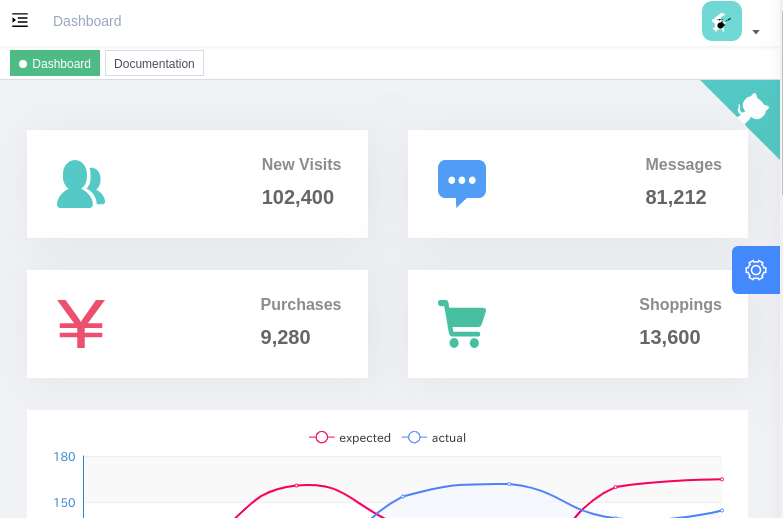
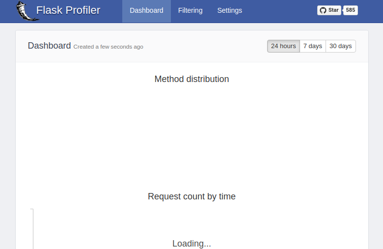

# docker-workload

This is workload for docker performance test.

## usage

### node

This workload supports `--scale` tag.

```shell
$ docker-compose up -d --scale vue-admin=10 vue-admin
$ docker-compose ps
            Name                          Command               State           Ports
----------------------------------------------------------------------------------------------
docker-workload_vue-admin_1    docker-entrypoint.sh npm r ...   Up      0.0.0.0:9522->9527/tcp
docker-workload_vue-admin_10   docker-entrypoint.sh npm r ...   Up      0.0.0.0:9517->9527/tcp
docker-workload_vue-admin_2    docker-entrypoint.sh npm r ...   Up      0.0.0.0:9516->9527/tcp
docker-workload_vue-admin_3    docker-entrypoint.sh npm r ...   Up      0.0.0.0:9520->9527/tcp
docker-workload_vue-admin_4    docker-entrypoint.sh npm r ...   Up      0.0.0.0:9521->9527/tcp
docker-workload_vue-admin_5    docker-entrypoint.sh npm r ...   Up      0.0.0.0:9518->9527/tcp
docker-workload_vue-admin_6    docker-entrypoint.sh npm r ...   Up      0.0.0.0:9525->9527/tcp
docker-workload_vue-admin_7    docker-entrypoint.sh npm r ...   Up      0.0.0.0:9523->9527/tcp
docker-workload_vue-admin_8    docker-entrypoint.sh npm r ...   Up      0.0.0.0:9515->9527/tcp
docker-workload_vue-admin_9    docker-entrypoint.sh npm r ...   Up      0.0.0.0:9519->9527/tcp
```

10 containers start up.

<http://localhost:9522/>



### python

```shell
$ docker-compose up -d --scale flask-profiler=10 flask-profiler
$ docker-compose ps
              Name                             Command               State           Ports
---------------------------------------------------------------------------------------------------
docker-workload_flask-profiler_1    python3 app.py                   Up      0.0.0.0:5010->5000/tcp
docker-workload_flask-profiler_10   python3 app.py                   Up      0.0.0.0:5005->5000/tcp
docker-workload_flask-profiler_2    python3 app.py                   Up      0.0.0.0:5009->5000/tcp
docker-workload_flask-profiler_3    python3 app.py                   Up      0.0.0.0:5007->5000/tcp
docker-workload_flask-profiler_4    python3 app.py                   Up      0.0.0.0:5004->5000/tcp
docker-workload_flask-profiler_5    python3 app.py                   Up      0.0.0.0:5006->5000/tcp
docker-workload_flask-profiler_6    python3 app.py                   Up      0.0.0.0:5003->5000/tcp
docker-workload_flask-profiler_7    python3 app.py                   Up      0.0.0.0:5008->5000/tcp
docker-workload_flask-profiler_8    python3 app.py                   Up      0.0.0.0:5002->5000/tcp
docker-workload_flask-profiler_9    python3 app.py                   Up      0.0.0.0:5012->5000/tcp
```

user:admin
password:admin

<http://127.0.0.1:5000/flask-profiler/>



### docker stats

You'll see cpu, memory, network and disk usage by `docker stats` command.

```shell
0255a736acae        docker-workload_vue-admin_11       0.00%               286.6MiB / 31.37GiB   0.89%               11.7kB / 0B         0B / 913kB          23
7dee5f871b9d        docker-workload_vue-admin_25       0.00%               287.6MiB / 31.37GiB   0.90%               11.7kB / 0B         4.1kB / 913kB       23
6e5df77c94b4        docker-workload_vue-admin_13       0.00%               296.7MiB / 31.37GiB   0.92%               11.7kB / 0B         61.4kB / 913kB      23
3853648a528e        docker-workload_vue-admin_12       0.00%               291.7MiB / 31.37GiB   0.91%               11.7kB / 0B         98.3kB / 913kB      23
6c55f841291e        docker-workload_vue-admin_27       0.00%               300MiB / 31.37GiB     0.93%               11.7kB / 0B         152kB / 487kB       23
e2eb83576fe3        docker-workload_vue-admin_32       0.00%               287.6MiB / 31.37GiB   0.90%               11.7kB / 0B         24.6kB / 913kB      23
0a005c18f727        docker-workload_vue-admin_14       0.00%               291.4MiB / 31.37GiB   0.91%               11.7kB / 0B         12.3kB / 4.1kB      23
88f757ce36fd        docker-workload_vue-admin_26       0.00%               291.3MiB / 31.37GiB   0.91%               11.7kB / 0B         77.8kB / 913kB      23
aade51f302e7        docker-workload_vue-admin_33       0.00%               290.4MiB / 31.37GiB   0.90%               11.7kB / 0B         41kB / 913kB        23
28fd34246299        docker-workload_vue-admin_15       0.00%               298.1MiB / 31.37GiB   0.93%               11.7kB / 0B         180kB / 913kB       23
7bfc041e9682        docker-workload_vue-admin_28       0.00%               295.4MiB / 31.37GiB   0.92%               11.7kB / 0B         41kB / 913kB        23
5adda96462b5        docker-workload_vue-admin_29       0.00%               312.7MiB / 31.37GiB   0.97%               7.25kB / 0B         0B / 913kB          23
8c420bf4c6ab        docker-workload_vue-admin_30       0.00%               311.2MiB / 31.37GiB   0.97%               7.25kB / 0B         0B / 913kB          23
d03b17b7704c        docker-workload_vue-admin_34       0.00%               289.4MiB / 31.37GiB   0.90%               11.7kB / 0B         0B / 913kB          23
0c955945df1b        docker-workload_vue-admin_31       0.00%               282.9MiB / 31.37GiB   0.88%               11.7kB / 0B         0B / 913kB          23
b963dbf4e463        docker-workload_vue-admin_35       0.00%               292.4MiB / 31.37GiB   0.91%               11.7kB / 0B         57.3kB / 913kB      23
c2d15a28fd78        docker-workload_vue-admin_36       0.00%               290.7MiB / 31.37GiB   0.90%               11.7kB / 0B         45.1kB / 913kB      23
9913970bfc86        docker-workload_vue-admin_38       0.00%               288.6MiB / 31.37GiB   0.90%               11.7kB / 0B         28.7kB / 913kB      23
30dc1c41d43c        docker-workload_vue-admin_37       0.00%               286.5MiB / 31.37GiB   0.89%               11.7kB / 0B         0B / 913kB          23
8ab7b693223d        docker-workload_vue-admin_16       0.00%               282.6MiB / 31.37GiB   0.88%               11.7kB / 0B         0B / 913kB          23
68b118259565        docker-workload_vue-admin_2        0.00%               294.8MiB / 31.37GiB   0.92%               11.7kB / 0B         1.09MB / 913kB      23
5025ca023418        docker-workload_vue-admin_39       0.00%               285.7MiB / 31.37GiB   0.89%               11.7kB / 0B         102kB / 913kB       23
65dcf6c58f9d        docker-workload_vue-admin_3        0.00%               288.3MiB / 31.37GiB   0.90%               11.7kB / 0B         0B / 913kB          23
23b7bce50a34        docker-workload_vue-admin_40       0.00%               293.2MiB / 31.37GiB   0.91%               11.7kB / 0B         12.3kB / 913kB      23
90d5cdb2b70a        docker-workload_vue-admin_17       0.00%               288.1MiB / 31.37GiB   0.90%               11.7kB / 0B         16.4kB / 913kB      23
116f72523c31        docker-workload_vue-admin_41       0.00%               294.1MiB / 31.37GiB   0.92%               11.7kB / 0B         4.1kB / 913kB       23
df99ecfb86e8        docker-workload_vue-admin_18       0.00%               293.4MiB / 31.37GiB   0.91%               11.7kB / 0B         12.3kB / 913kB      23
1366e283c8cc        docker-workload_vue-admin_4        0.00%               299.4MiB / 31.37GiB   0.93%               11.7kB / 0B         180kB / 913kB       23
8e3f33b600d0        docker-workload_vue-admin_5        0.00%               316.2MiB / 31.37GiB   0.98%               8.6kB / 0B          5.25MB / 913kB      23
992d116a4c53        docker-workload_vue-admin_19       0.00%               293.8MiB / 31.37GiB   0.91%               11.7kB / 0B         8.19kB / 913kB      23
959ba95a18b5        docker-workload_vue-admin_20       0.00%               336.2MiB / 31.37GiB   1.05%               11.7kB / 0B         0B / 913kB          23
29c815a25bc7        docker-workload_vue-admin_42       0.00%               290.1MiB / 31.37GiB   0.90%               11.7kB / 0B         28.7kB / 1.08MB     23
a97d5e0de203        docker-workload_vue-admin_6        0.00%               307.9MiB / 31.37GiB   0.96%               8.6kB / 0B          6.23MB / 913kB      23
8127c4823399        docker-workload_vue-admin_43       0.00%               295.6MiB / 31.37GiB   0.92%               11.7kB / 0B         135kB / 913kB       23
a9b73c82940d        docker-workload_vue-admin_21       0.00%               296.3MiB / 31.37GiB   0.92%               11.7kB / 0B         57.3kB / 913kB      23
0e13bd1cb1d9        docker-workload_vue-admin_8        0.00%               292.3MiB / 31.37GiB   0.91%               11.7kB / 0B         0B / 913kB          23
06d31ed0a4c7        docker-workload_vue-admin_7        0.00%               294.1MiB / 31.37GiB   0.92%               11.7kB / 0B         0B / 913kB          23
2d5a5dc4addb        docker-workload_flask-profiler_2   0.78%               34.67MiB / 31.37GiB   0.11%               11.3kB / 0B         3.33MB / 41kB       3
162daa096e19        docker-workload_flask-profiler_4   0.57%               35.2MiB / 31.37GiB    0.11%               11.7kB / 0B         28.7kB / 41kB       3
545681811d5c        docker-workload_vue-admin_44       0.00%               293.8MiB / 31.37GiB   0.91%               11.7kB / 0B         0B / 913kB          23
649cbd78560d        docker-workload_vue-admin_22       0.00%               291.2MiB / 31.37GiB   0.91%               11.9kB / 0B         5.59MB / 1.13MB     23
e389908fd0f0        docker-workload_vue-admin_45       0.00%               297.2MiB / 31.37GiB   0.93%               11.9kB / 0B         0B / 913kB          23
2556b6df1fc4        docker-workload_flask-profiler_5   0.96%               34.82MiB / 31.37GiB   0.11%               11.7kB / 0B         0B / 41kB           3
b731b9b5175c        docker-workload_flask-profiler_3   0.77%               35.02MiB / 31.37GiB   0.11%               11.3kB / 0B         8.19kB / 41kB       3
8f25404c825f        docker-workload_vue-admin_10       0.00%               311.2MiB / 31.37GiB   0.97%               12kB / 0B           41kB / 1.13MB       23
3191de60145f        docker-workload_vue-admin_9        0.00%               298.1MiB / 31.37GiB   0.93%               11.7kB / 0B         250kB / 913kB       23
0b4a6c6a4553        docker-workload_vue-admin_24       0.00%               288.5MiB / 31.37GiB   0.90%               11.7kB / 0B         20.5kB / 913kB      23
51dd3f547159        docker-workload_vue-admin_23       0.00%               295MiB / 31.37GiB     0.92%               11.7kB / 0B         0B / 1.13MB         23
d0a7c48c01e4        docker-workload_vue-admin_1        0.00%               304.7MiB / 31.37GiB   0.95%               13kB / 0B           28.7kB / 913kB      23
6886196face0        docker-workload_flask-profiler_1   0.60%               34.47MiB / 31.37GiB   0.11%               12.6kB / 0B         0B / 41kB           3
```

## FAQ

### ENOSPC: System limit for number of file watchers reached

If you get bellow error when up containers.

```shell
Error: ENOSPC: System limit for number of file watchers reached, watch '/home/node/app/mock'
```

You must change system limit to watch files.

```shell
$ cat /proc/sys/fs/inotify/max_user_watches
65536
$ sudo sysctl fs.inotify.max_user_watches=524288
$ cat /proc/sys/fs/inotify/max_user_watches
524288
```

## Reference

1. <https://github.com/PanJiaChen/vue-element-admin>
2. <https://github.com/muatik/flask-profiler>
3. <https://github.com/brianfrankcooper/YCSB/tree/master/mongodb>
