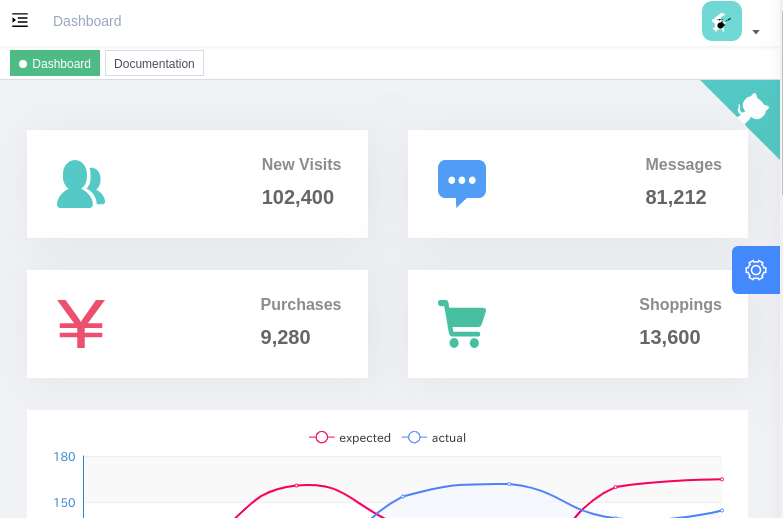

# docker-workload

This is workload for docker performance test.

## node

This workload supports `--scale` tag.

```shell
$ docker-compose up -d --scale vue-admin=10 vue-admin
$ docker-compose ps
            Name                          Command               State           Ports
----------------------------------------------------------------------------------------------
docker-workload_vue-admin_1    docker-entrypoint.sh npm r ...   Up      0.0.0.0:9522->9527/tcp
docker-workload_vue-admin_10   docker-entrypoint.sh npm r ...   Up      0.0.0.0:9517->9527/tcp
docker-workload_vue-admin_2    docker-entrypoint.sh npm r ...   Up      0.0.0.0:9516->9527/tcp
docker-workload_vue-admin_3    docker-entrypoint.sh npm r ...   Up      0.0.0.0:9520->9527/tcp
docker-workload_vue-admin_4    docker-entrypoint.sh npm r ...   Up      0.0.0.0:9521->9527/tcp
docker-workload_vue-admin_5    docker-entrypoint.sh npm r ...   Up      0.0.0.0:9518->9527/tcp
docker-workload_vue-admin_6    docker-entrypoint.sh npm r ...   Up      0.0.0.0:9525->9527/tcp
docker-workload_vue-admin_7    docker-entrypoint.sh npm r ...   Up      0.0.0.0:9523->9527/tcp
docker-workload_vue-admin_8    docker-entrypoint.sh npm r ...   Up      0.0.0.0:9515->9527/tcp
docker-workload_vue-admin_9    docker-entrypoint.sh npm r ...   Up      0.0.0.0:9519->9527/tcp
```


10 containers start up.


<http://localhost:9522/>




## python


<http://127.0.0.1:5000/flask-profiler/>